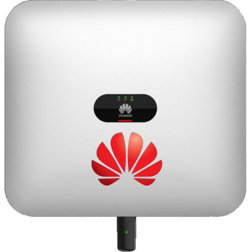

# ioBroker.sun2000

**Tests:** 

## sun2000 adapter for ioBroker

Read register data from Huawei SUN2000 inverter and LUNA2000 battery using Modbus TCP. 

Feel free to follow the discussions in the german [iobroker forum](https://forum.iobroker.net/topic/71768/test-adapter-sun2000-v0-1-x-huawei-wechselrichter)

Modbus interface definition (Issue 5, 2023-02-16):
https://forum.iobroker.net/assets/uploads/files/1699119419919-solar-inverter-modbus-interface-definitions-v5.pdf

## Supported hardware

* HUAWEI Inverter SUN2000 Serie (M0,M1) 
* HUAWEI Smart Dongle-WLAN-FE / min. Softwareversion: V100R001C00SPC133 (SDongleA-05)
* HUAWEI Luna2000 Battery
* HUAWEI Smart Power Sensor DTSU666-H or DDSU666-H

[Huawei product information](https://solar.huawei.com/en/professionals/all-products?residential-smart-pv)

## Feature list

* Maximum 5 inverters (master/slave) can be processed, each with a battery module (max. 15kWh).
* Real-time values such as input power, output power, charging/discharging power and the grid consumption are read out at a fixed interval. 
* States are only written for changed data from the inverter. This relieves the burden on the iobroker instance.
* The states “inputPower” or “activePower” in the “collected” path can be monitored with a “was updated” trigger element. Because these states are always written within the set interval.

## Main Settings
* `address`: Inverter IP address
* `port`: Inverter modbus port (default: 502)
* `modbusIds`: inverter IDs, separated with "," (default: 1, max. 5 inverters)
* `updateInterval`: Fast update interval (default: 20 sec, smallest 5 seconds per inverter)
## Modbus timing 
* `timeout`: modbus connection timeout (default: 10000 ms)
* `delay`: delay between modbus requests (default: 0 ms)
* `connect delay`: delay after modbus connected (default: 5000 ms)
* `auto-adjust`: automatic adjustment of the modbus settings

## Configure inverters

In order to use the Modbus connection, all Huawei devices must use the latest firmware
feature. You can perform latest firmware directly in the FusionSolar portal under “Upgrades”.
In the FusionSolar setup you still have to activate the Modbus on the WLAN dongle and set the access authorization. Download the FusionSolar-App onto your cell phone and use it to connect via the inverter's WLAN hotspot directly.  
After the click on `Me` (Ich) in the footer Menu> `Commission Device` ("Inbetriebnahme des Geräts“) > `log in` (am Wechselrichter anmelden).

To log into the app as an `installer` you need usually the password:`00000a` or `0000000a` 
You may also need a password to connect to the inverters own WLAN: `Changeme` 

After login on the inverter go to `Settings` (Einstellungen) > `Communication configuration` (Kommunikationskonfiguration) > `Dongle parameter settings` (Dongle‐Parametereinstellungen) > `Modbus TCP` > Activate the `connection without restriction` (Verbindung uneingeschränkt aktivieren). You can also enter the Modbus comm address at the same time read out. 
If you use two inverters, then connect to the second inverter and read the communication address there too. 

[How activate 'Modbus TCP' - from huawei forum](https://forum.huawei.com/enterprise/en/modbus-tcp-guide/thread/789585-100027)

## Inspiration

The development of this adapter was inspired by discussions from the forum thread https://forum.iobroker.net/topic/53005/huawei-sun2000-iobroker-via-js-script-funktioniert and the iobroker javascript https://github.com/ChrisBCH/SunLuna2000_iobroker.

## Changelog

<!--
	Placeholder for the next version (at the beginning of the line):
	### **WORK IN PROGRESS**
-->

### **WORK IN PROGRESS**
* collected `sun2000.0.collected.chargeDischargePowercharge` is not refreshed #47

### 0.3.0 (2024-02-10)
* add battery unit information for example temperature #40
* modbus timeout, connect delay and delay can be configured #34
* device status as plain text `sun2000.0.inverter.x.derived.deviceStatus`
* Introduction of a driver model. A separate driver can be created for each device #41

### 0.2.1 (2024-02-02)
* Requirements from [Add sun2000 to latest](https://github.com/ioBroker/ioBroker.repositories/pull/3219)

### 0.2.0 (2024-01-24)
* [Add sun2000 to latest](https://github.com/ioBroker/ioBroker.repositories/pull/3219)
* improve error handling (#34)
* add simple optimizer info 
* Riemann sum of input power with energy loss for new state `dailySolarYield`
* try to recreate the `yield today` from the fusion portal

### 0.1.3 (2024-01-17)
* display the data from PV strings (#27)
* optimize the timing of interval loop
* improved handling of read timeouts from more then 2 inverters

### 0.1.2 (2024-01-12)
* fix: no Data if interval less 20 sec (#24)
* prepare collected values more precisely
* expand up to 5 inverters #18
* fix: problems with multiple inverters

### 0.1.1 (2024-01-07)
* fix some collected values

### 0.1.0 (2024-01-06)
* watchdog implemented #11
* state values are cached - only changed data should be stored 
* derived and collected values for example `inputPowerEffective` or `inputYield`
* deploy more register

### 0.0.2 (2023-12-19)
Dependency and configuration updates

### 0.0.1 
initial release

## License
MIT License

Copyright (c) 2024 bolliy <stephan@mante.info>

Permission is hereby granted, free of charge, to any person obtaining a copy
of this software and associated documentation files (the "Software"), to deal
in the Software without restriction, including without limitation the rights
to use, copy, modify, merge, publish, distribute, sublicense, and/or sell
copies of the Software, and to permit persons to whom the Software is
furnished to do so, subject to the following conditions:

The above copyright notice and this permission notice shall be included in all
copies or substantial portions of the Software.

THE SOFTWARE IS PROVIDED "AS IS", WITHOUT WARRANTY OF ANY KIND, EXPRESS OR
IMPLIED, INCLUDING BUT NOT LIMITED TO THE WARRANTIES OF MERCHANTABILITY,
FITNESS FOR A PARTICULAR PURPOSE AND NONINFRINGEMENT. IN NO EVENT SHALL THE
AUTHORS OR COPYRIGHT HOLDERS BE LIABLE FOR ANY CLAIM, DAMAGES OR OTHER
LIABILITY, WHETHER IN AN ACTION OF CONTRACT, TORT OR OTHERWISE, ARISING FROM,
OUT OF OR IN CONNECTION WITH THE SOFTWARE OR THE USE OR OTHER DEALINGS IN THE
SOFTWARE.